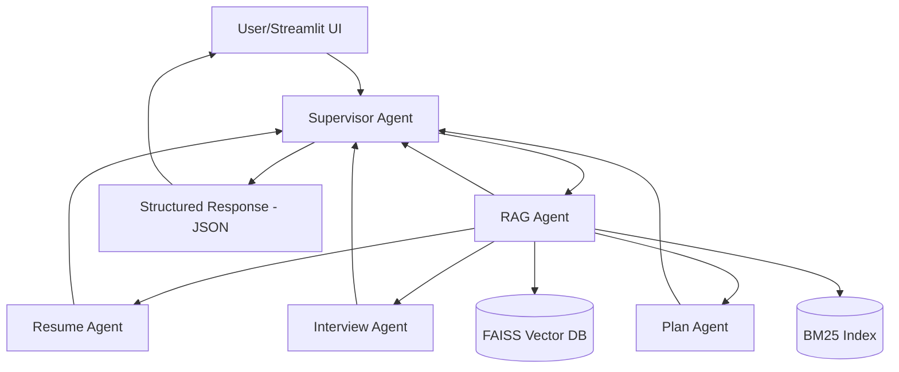
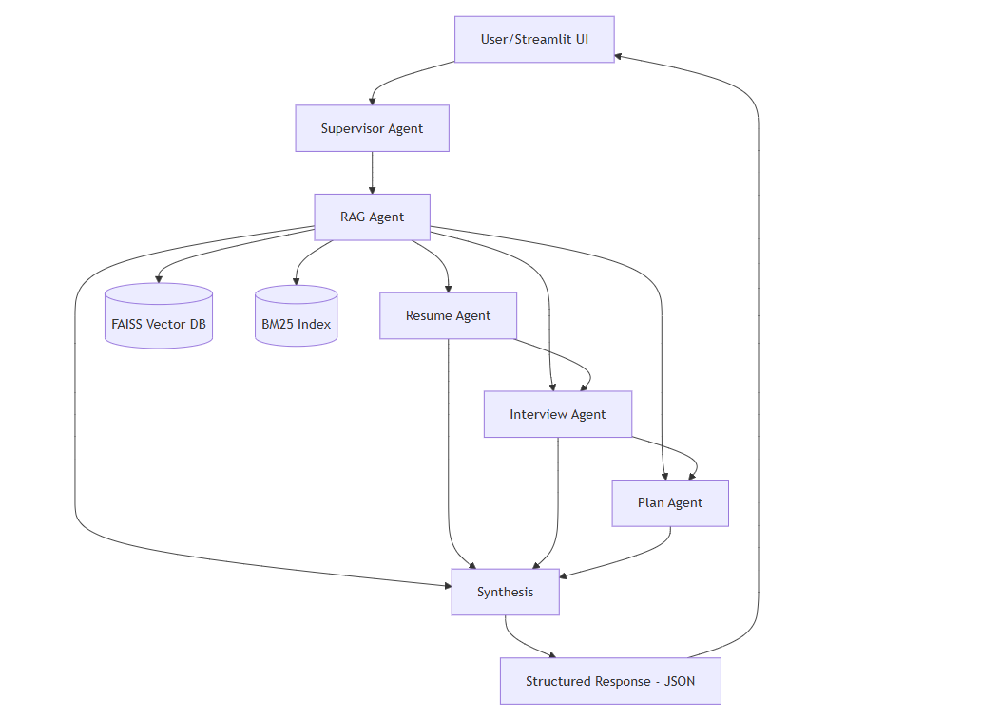
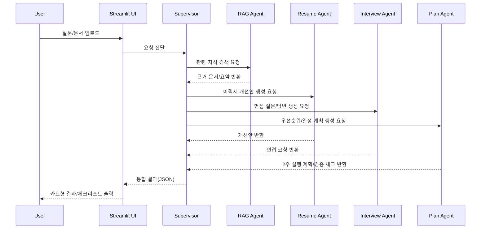
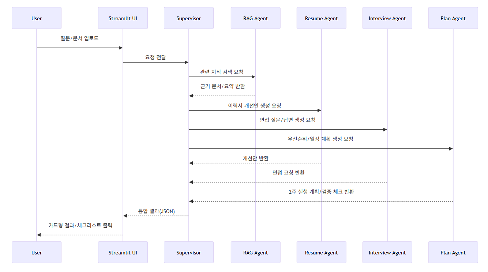

[Step2 - 기획 및 설계]

**[서비스명 - JobPilot AI (잡파일럿)]**

**1. 프로젝트 개요 – 기획 배경 및 핵심 내용**

### **1.1 프로젝트 기획 배경**

- **어떤 문제를 해결하고자 하는가?**  
  취업/이직 준비 과정에서 흩어진 정보(채용공고, 직무역량, 이력서 피드백, 면접 대비)를 한 번에 정리하고 실행 가능한 액션 플랜으로 제공하는 문제를 해결하고자 합니다.

- **기존 방식의 한계는 무엇인가?**  
  검색/커뮤니티/문서 템플릿을 각각 따로 사용해야 하며, 사용자 경력/직무 맥락을 반영한 맞춤형 피드백이 부족합니다.

- **Agent 서비스로 해결할 수 있는 Pain Point는 무엇인가?**  
  멀티 에이전트가 역할을 분담하여(공고 분석, 이력서 개선, 면접 질문 생성, 일정 계획) 빠르게 맞춤형 결과를 제공하고, RAG로 근거 기반 응답의 신뢰성을 높일 수 있습니다.

- **이 프로젝트를 시작하게 된 동기는 무엇인가?**  
  취업 준비는 정보 탐색보다 "실행 우선순위"가 핵심인데, 이를 자동화/개인화한 서비스 수요가 높다고 판단했습니다.

### **1.2 핵심 아이디어 및 가치 제안(Value Proposition)**

- **서비스가 제공하는 핵심 기능은 무엇인가?**  
  1) 공고-이력서 갭 분석(`jd_text` + `resume_text` 비교), 2) 맞춤 이력서/포트폴리오 개선안, 3) 직무별 면접 질문/모범답변, 4) 2주 실행 플랜 자동 생성

- **사용자에게 제공되는 가치와 기대효과는 무엇인가?**  
  준비 시간 단축, 준비 품질 향상, 실제 면접 대응력 강화, 일관된 학습/준비 루틴 형성

- **기존 서비스 대비 차별성은 무엇인가?**  
  단일 챗봇이 아닌 역할 기반 Multi-Agent + RAG 결합으로 "근거 있는 코칭 + 실행 계획"까지 종단 간(End-to-End) 제공

- **차별성 검증 포인트(단일 챗봇 대비)**
  - 라우팅 정확도: 의도 라벨(`resume_only`, `interview_only`, `plan_only`, `full`) 기준 샘플 질의셋 Top-1 정확도 측정
  - 근거 포함률: 최종 응답에서 `references`가 1개 이상 포함된 비율과, 근거-본문 의미 일치 여부(수기 체크리스트) 측정
  - 실행 플랜 품질: `two_week_plan` 항목의 실행 가능성(구체 행동/기한/우선순위 포함 여부) 점수화(예: 5점 척도) 비교
  - 자동화 경로: `scripts/evaluate_differentiation_metrics.py` + `data/eval/sample_queries.json`로 배치 평가(임계치 미달 시 실패 코드 반환)

### **1.3 대상 사용자 및 기대 사용자 경험(UX)**

- **주요 타겟**  
  신입 구직자, 주니어/미드레벨 이직 준비자, 부트캠프 수료생

- **사용자에게 어떤 흐름과 경험을 제공할 것인가?**  
  질문 입력/직무 선택 -> 자료 업로드(JD/공고 + 이력서 파일 또는 텍스트) -> 분석 결과 확인 -> 입력 기록 저장 -> 필요 시 "다시 불러오기"로 과거 입력/결과 복원 -> 액션 아이템 실행

- **사용자가 서비스에서 얻는 구체적 Benefit은 무엇인가?**  
  "지금 무엇을 고쳐야 하는지"가 명확한 체크리스트와 근거 문서 기반 조언, 즉시 활용 가능한 답변 초안

**2. 기술 구성 – 서비스에 적용할 기술 스택**

*아래 항목을 참고해 서비스에 적용한 기술 / 방식 등을 정리하세요*

### **2.1 Prompt Engineering 전략**

- **역할 기반 프롬프트**  
  Supervisor, Resume Agent, Interview Agent, RAG Agent 각각의 시스템 프롬프트 분리

- **고품질 응답 전략(Few-shot + 근거 기반 요약)**  
  직무별 예시 답변(Few-shot) + 근거 문장/출처 기반 요약 + 금지 규칙(근거 없는 단정 금지, 생각 과정 비노출)
  - Tool 활용 실효성 강화: 도구 출력은 JSON(점수/키워드/질문 배열)으로 표준화하고, Agent가 이를 최소 1회 이상 본문에 반영하도록 지시

- **출력 구조화 템플릿 정의**  
  JSON 스키마 기반 출력(요약, 강점/약점, 개선안, 근거 출처, 다음 액션)
  - route-aware 출력 규칙: `resume_only / interview_only / plan_only / full` 라우트에 따라 섹션 최소 개수/표시 여부를 다르게 적용해 불필요 섹션은 빈 배열로 반환
  - 라우트 최소 개수 정책: `resume_only/interview_only`는 `two_week_plan` 최소 개수를 0으로 두어 "플랜 제외" 시나리오와 일치
  - 요약 정책 통일: `plan_only`를 포함한 모든 라우트에서 `summary`는 항상 제공하며, `plan_only`는 1~2문장으로 짧게 유지
  - 근거 추적 강화: 중간 산출물에 `evidence_map`(항목 -> 근거 chunk 번호)과 최종 액션 불릿의 citation(`[1][2]`) 표기를 요구해 근거-결론 연결성을 명시

- **사용자 유형/상황별 프롬프트 분기**  
  신입/경력, 직무(백엔드/데이터/PM), 목표 회사 수준(대기업/스타트업)에 따라 프롬프트 분기

### **2.2 LangChain / LangGraph 기반 Agent 구조**

- **Multi-Agent 설계 개념**  
  Supervisor가 사용자 요청을 분류/라우팅하고, RAG 근거를 공통으로 확보한 뒤 Resume/Interview/Plan Agent가 분업 처리한 결과를 통합해 최종 응답 생성

- **각 Agent의 역할(Role) 정의**  
  - `Supervisor(Planner 역할 포함)`: 요청 분해, 우선순위 결정, 결과 통합  
  - `Resume Agent`: 이력서/포트폴리오 개선  
  - `Interview Agent`: 예상 질문/답변 코칭  
  - `Plan Agent`: 우선순위/일정/검증 방법 중심 2주 실행 계획 수립  
  - `RAG Agent`: 지식 검색 및 근거 제공(plan_only 포함 모든 라우트에서 최소 근거 확보)

- **Tool Calling, ReAct, Memory 활용 여부**  
  Tool Calling(필수), ReAct 스타일 도구 루프(max step 기반 종료), 세션 메모리 + LangGraph Checkpointer(그래프 실행 상태) 적용

### **2.3 RAG 구성**

- **데이터 수집/전처리 파이프라인**  
  채용공고, 직무기술서, 면접 가이드, 포트폴리오 예시 문서(TXT/MD/CSV/PDF/DOCX/XLSX) 수집 -> 정규화 -> 청킹

- **임베딩 모델 및 Vector DB 선택**  
  `text-embedding-ada-002`(환경변수 `AOAI_DEPLOY_EMBED_ADA`) + FAISS

- **검색 로직과 응답 생성 방식**  
  하이브리드 검색(BM25 + 벡터 유사도) -> 상위 문서 재정렬 -> 출처 포함 응답 생성
  - 재현성 관리: 형태소 분석기(`kiwi/okt`) 사용 여부와 fallback 토크나이저 적용 결과를 메타에 기록해 환경별 품질 편차를 추적
  - 튜닝 포인트 분리: 하이브리드 가중치(`VECTOR_WEIGHT`, `BM25_WEIGHT`)를 설정값으로 분리해 실험/운영에서 빠르게 조정
  - 안전모드 고도화: 검색 결과가 있더라도 최고 점수가 임계치 미만이면(`RAG_EVIDENCE_SCORE_THRESHOLD`) 근거 부족 모드로 전환해 보수적 표현을 우선
  - 내구성 보강: route-aware 카테고리 필터 적용 후 결과가 비면 필터 없이 재검색(fallback)해 근거 누락을 완화
  - 카테고리 품질 진단: 인덱스 빌드 시 카테고리 분포/`uncategorized` 비중을 점검하고, 비중 과다 또는 필수 카테고리 누락 시 경고와 진단 메타를 `retriever_meta.json`에 기록
  - 리랭크 확장성 분리: 휴리스틱 리랭킹을 `src/retrieval/rerank.py`로 분리하고 `RERANK_ENABLED`, `RERANK_PROVIDER` 설정으로 전략 on/off 및 교체 포인트를 표준화
  - 업로드 입력 근거 편입: `jd_text/resume_text`를 임시 청크(ephemeral evidence)로 생성해 검색 후보에 혼합하여 공고-이력서 갭 분석의 직접 근거성을 강화

- **도메인 지식 범위(출처 유형/라이선스/최신성)**  
  - 출처 유형: 채용공고 요약본, 직무기술서(JD) 정리본, 면접 가이드, 포트폴리오 작성 예시  
  - 저장 경로/카테고리: `data/knowledge/job_postings/*`, `data/knowledge/jd/*`, `data/knowledge/interview_guides/*`, `data/knowledge/portfolio_examples/*`  
  - 카테고리 보완 정책: 운영 중 루트 문서가 존재해도 필터가 과도하게 누락되지 않도록 `uncategorized` 카테고리를 route-aware 필터에서 허용
  - 라이선스 원칙: 공개적으로 활용 가능한 문서/직접 작성한 요약본 중심으로 구성하며, 저작권 제약이 있는 원문은 전문 저장 대신 요약/메타데이터만 반영  
  - 최신성 관리: 월 1회 이상 문서 갱신 점검(수집일/수정일 메타 기록), 오래된 공고/가이드는 우선순위 하향 처리
  - 최소 요건 체크리스트:
    - [ ] 카테고리별 최소 1개 문서(`job_postings/`, `jd/`, `interview_guides/`, `portfolio_examples/`)
    - [ ] 최신성 기준(최근 3개월 우선, 오래된 문서는 라벨링/교체)
    - [ ] 금지 콘텐츠 제외(개인정보 원문, 저작권 위반 원문 전문, 근거 불명확 문서)

- **RAG 안전 정책(신뢰성 설계)**
  - 근거 부족 시 전환: 검색 결과가 부족하거나 신뢰 점수가 낮은 경우, "일반 가이드 기반 조언"으로 전환하고 단정형 표현을 제한
  - 출처 우선 응답: 가능하면 `references`에 문서 출처를 포함하고, 근거가 없는 주장은 권장안 형태(조건부 표현)로만 제시
  - 추적성 강화: `references`는 rank/source/location/chunk 정보를 포함한 형태로 제공해 citation과 출처 간 연결을 명확화
  - 도메인 범위 고지: 지식 범위를 벗어나는 질문은 범용 취업 준비 가이드로 응답하며, 추가 문서 업로드를 사용자에게 안내

### **2.4 서비스 개발 및 패키징 계획**

- **UI 개발 방식(Streamlit, React 등)**  
  Streamlit 기반 대화형 UI(질문/직무 입력, JD/공고 + 이력서 파일 업로드, 결과 카드, 실행 입력 기록 조회/삭제, 다시 불러오기, 입력란 내부 실시간 카운터(`max_chars`) 기반 대용량 입력 방어)
  - 인덱스 UX 보강: 첫 실행 인덱싱 지연을 안내하고, 관리용 "인덱스 사전 빌드/로드" 동작을 제공해 대기 시간을 예측 가능하게 설계
  - 개인정보 옵션: 실행 입력 기록 파일 저장 on/off와 저장 전 이메일/전화번호 마스킹 옵션으로 운영 환경의 민감정보 노출 리스크 완화

- **BE(API) 및 배포 전략(FastAPI, Docker 등)**  
  FastAPI로 Agent 실행 API 분리, 예외 처리(400/500)로 사용자 친화적 오류 응답 제공, 로컬 Docker 옵션 제공(선택)
  - 에러 처리 표준화: 문자열 파싱 대신 `error_code/detail` 공통 계약(`JobPilotError`)을 API/CLI/UI에 일관 적용해 프론트-백 분기 안정성 확보

- **설정/환경 관리 계획**  
  `final-project/.env` 사용, `src/config/settings.py`에서 로드, `requirements-final.txt`로 의존성 고정, 필요 시 `INDEX_FORCE_REBUILD=true`로 인덱스 강제 재생성

### **2.5 선택적 확장 기능**

- **LLM Fundamentals 기반 Structured Output / Function Calling**  
  결과를 JSON으로 강제하여 UI 렌더링 안정화

- **MCP 기반 파일/시스템/API 연동**  
  로컬 파일 검색/회사 정보 API 연계(확장 옵션)

- **A2A 기반 Agent 협업 구조**  
  향후 외부 에이전트(면접 시뮬레이터)와 협업 가능한 인터페이스 설계

- **안정성/복원성 확장(운영 관점)**  
  Structured Output 실패 시 노드별 fallback(최소 필드 degrade) 적용, 체크포인터 기반 세션 복원으로 재실행 비용 최소화

**3. 주요 기능 및 동작 시나리오**

### **3.1 사용자 시나리오(Use Case Scenario)**

- **사용자 목표와 과제 흐름**  
  "백엔드 개발자 이직 준비" 목표로 공고와 이력서를 업로드해 부족 역량을 파악하고 2주 계획 수립

- **서비스 이용 단계별 행동 정의**  
  1) 목표 직무 선택 및 질문 입력 -> 2) JD/공고 + 이력서 파일 업로드/텍스트 입력 -> 3) 멀티 에이전트 분석 실행 -> 4) 결과 확인 및 저장 -> 5) 필요 시 기록에서 다시 불러오기 -> 6) 개선안 반영 및 최종 점검

### **3.2 시스템 구조도 / Multi-Agent 다이어그램**

*아래 두 가지 중 하나 이상 필수 업로드*

- 시스템 전체 구조도
- Multi-Agent 구성도(LangGraph 등 사용 가능)

> Preview에서 Mermaid가 보이지 않을 경우를 대비해, 아래 이미지 버전을 함께 첨부합니다.
>
> 
>
> - 이미지 산출물 경로: `docs/images/system_architecture.png`

### **3.3 서비스 플로우(Flow Chart / Sequence Diagram 등)**

- 사용자 요청 -> Agent 처리 -> RAG 검색 -> 응답 생성 -> UI 출력까지 흐름

> Preview에서 Mermaid가 보이지 않을 경우를 대비해, 아래 이미지 버전을 함께 첨부합니다.
>
> 
>
> - 이미지 산출물 경로: `docs/images/service_flow_sequence.png`

## **4. 실행 결과**

*개발 IDE에서 실행될 예정이므로 내용 요약 작성*

- **서비스 실행 결과 (text)**  
  사용자가 직무와 문서를 입력하면, 서비스는  
  1) 공고-이력서 갭 분석,  
  2) 우선순위 개선 항목 Top 5,  
  3) 직무 맞춤 면접 질문/답변,  
  4) 2주 실행 계획과 참고 출처를 제공함.

- **데모 이미지 or 영상 등**  
  제출용 산출물은 `docs/evidence/`에 관리함:  
  - `docs/evidence/e2e_test_checklist.md` (CLI/FastAPI/Streamlit 통합 실행 체크리스트)  
  - `docs/evidence/streamlit_main_capture.png` (Streamlit 메인 화면 캡처: 입력/출력 동시 노출)  
  - `docs/evidence/agent_execution_log.md` (Supervisor 라우팅 + RAG 검색 근거)  
  - `docs/evidence/agent_final_answer.json` (최종 구조화 응답 원본)  
  - (선택) 1~2분 데모 영상(시나리오 1회 실행)

## **5. 프로젝트 수행 소감 / 피드백**

교육 과정에서 가장 크게 배운 점은 "좋은 모델 선택"보다 "좋은 구조 설계"가 서비스 품질을 더 크게 좌우한다는 점이었습니다.  
특히 Prompt Engineering, Multi-Agent 분업, RAG 기반 근거 제시를 하나의 흐름으로 연결하면서, 단일 기능 데모와 실제 서비스 수준 구현의 차이를 체감했습니다.

구현 과정에서는 에이전트 역할 분리와 출력 구조화(JSON 강제)가 안정성에 매우 중요하다는 것을 확인했습니다.  
또한 데이터 전처리와 청킹 전략에 따라 검색 품질이 크게 달라졌고, 응답 정확도 개선을 위해서는 모델 파라미터보다 RAG 파이프라인 설계가 선행되어야 함을 배웠습니다.

향후에는 리랭커 도입, 사용자별 장기 메모리, 평가 자동화 지표를 추가해 더 실무적인 품질 관리 체계를 구축하고자 합니다.  
이번 프로젝트는 "기능 구현"을 넘어 "재사용 가능한 구조 설계"의 중요성을 학습한 계기였습니다.

## **6. 추가 아이디어 (선택)**

향후 개선하고 싶은 기능이나 확장 아이디어를 자유롭게 작성하세요.

* *데이터 품질 개선, 타겟 분류 로직 고도화*  
  직무/경력/산업군 메타데이터를 정교화하고, Supervisor 라우팅 규칙을 세분화해 개인화 정확도와 추천 일관성을 높입니다.

* *성능 최적화, 알림 채널 확대, UX 개선 등*  
  인덱스 재생성 비용을 줄이는 캐시 전략을 강화하고, 이메일/메신저 알림 연동 및 실행 기록 비교 UI를 추가해 사용성을 개선합니다.
